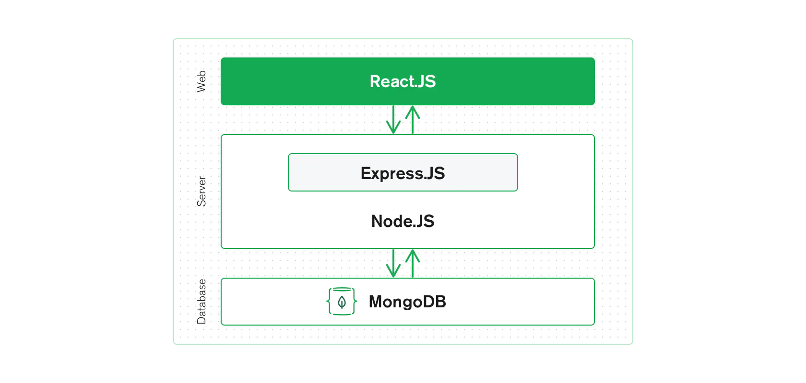
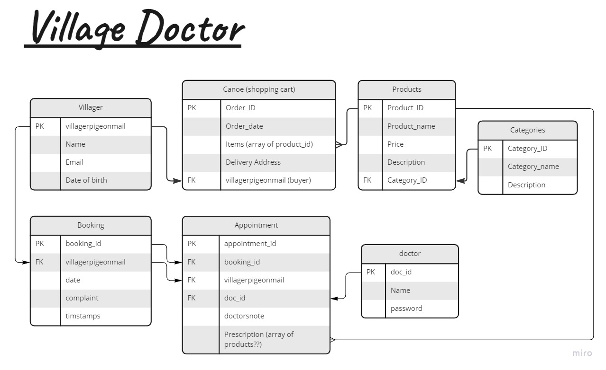
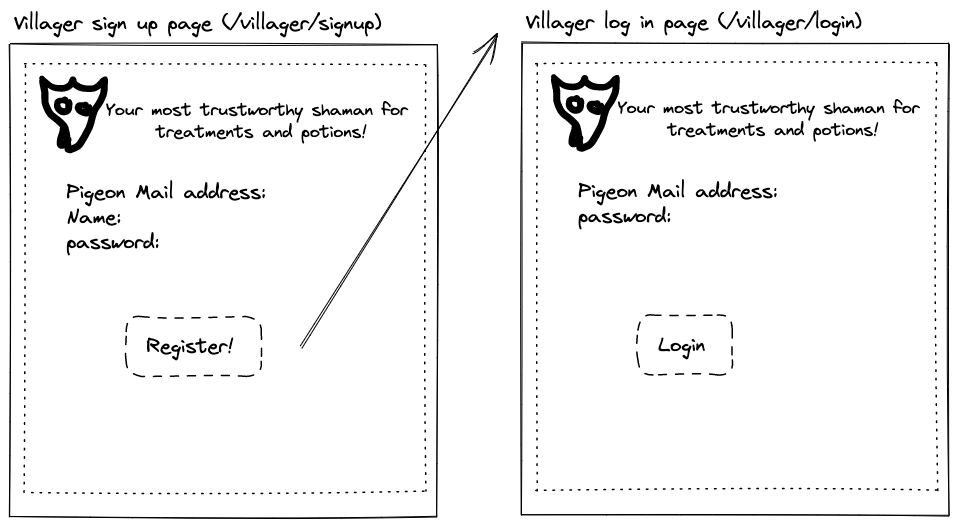
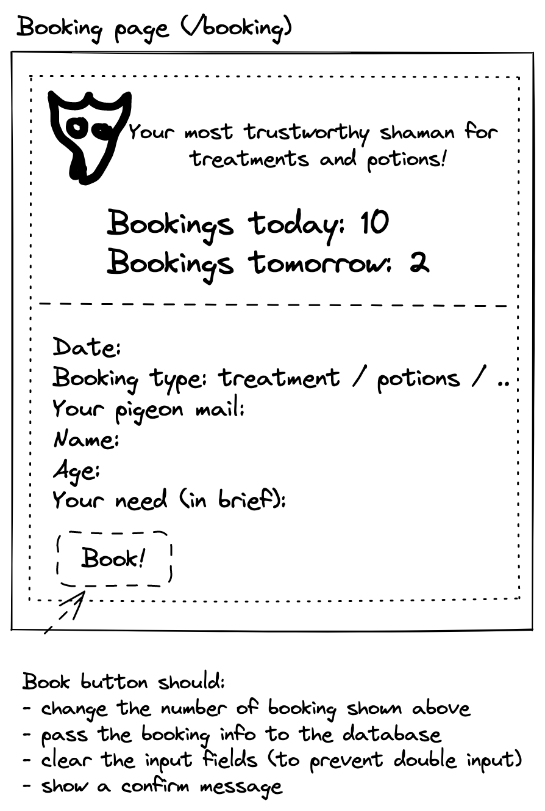
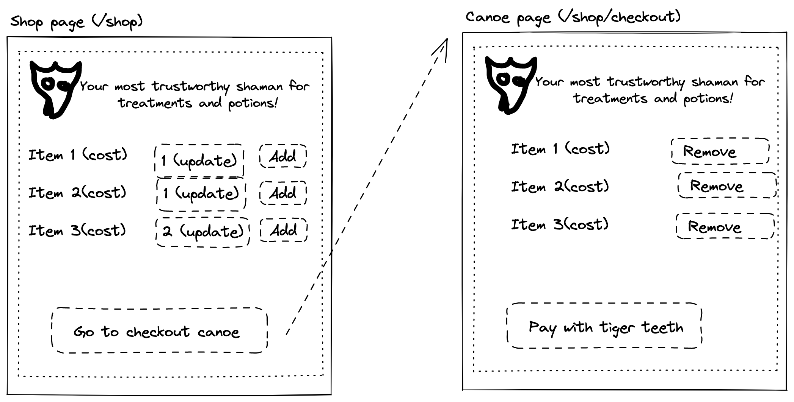
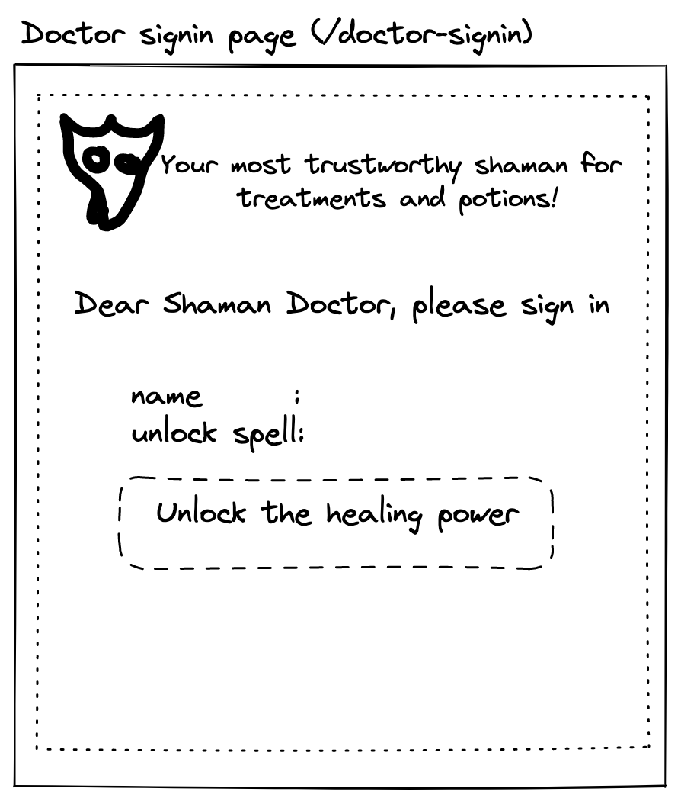

# Village Shaman Doctor

This is a MERN exercise project using React framework. It aims as learning in a fun way. There might be many unreasonable settings, feel free to laugh at me.  

The project aims to build a frontend and a backend website for a imaginary village shaman doctor's clinic, where villgers can book appointments with the doctors, or to buy various items from the shaman doctor.  

The Frontend folder includes the frontend of the web application while the Backend folder includes the backend of the web application.  

## Tech
It is my first personal project with MERN. I chose MERN because I want to build a project with a separate frontend, backend, and a database. MERN works with the separation of concern pricinple. 

<figure>

<figcaption align= center>Copyright: MongoDB</figcaption>
</figure>

My approach is to build a front end web service which is separated from a back end web service, so that I can scale up either end, or even replace one side with another programming langauge. That is why the domain address of backend server is not hardcoded, but was saved in a separate file `http-common.js`, which allows easy redirection.    

The Front end application is divided into two halves, the doctors' side and the villagers' side, the functions are completely different but they get data from the same database. The back end server, therefore, is also divided into two havles. Theoretically, these parts can be migrated completely to another server if there is such need. Enhancement or feature change can be brought about without bringing the whole service down.  

The heart of the whole application is the database. While in the testing environment, a local MongoDB is used, however, it can be migrated to MongoDB Atlas easily, which allows more flexibility.  

### Frontend
[React](https://reactjs.org/) - Frontend framework  
[bootstrap](https://getbootstrap.com/) - Styling  

### Backend
[MongoDB](https://www.mongodb.com/) - Database  
[Node.js](https://nodejs.org/en/) - Javascript Runtime  
[Express](https://expressjs.com/) - Web server framework for Node.js  

### Other tools
[Postman](https://www.postman.com/) - API testing tool for backend  
[TablePlus](https://tableplus.com/) - GUI tool for database  


## User Stories

### Villagers
[x] As a villager,  
so that I can log-in the website,  
I want to sign up.  

[x] As a villager,  
so that I can use the clinic service,  
I want to log in.  

[x] As a villager,
so that my data is protected,  
I want my password to be hashed.  

[] As a villager,
so that I can see doctor,  
I want to make a booking with doctor with my chosen date.  

[x] As a villager,
so that I can browse store,  
I want to be able to view available items.  

[] As a villager,
so that I can browse store,  
I want to be able to view items of a selected category. 

[] As a villager,
so that I can buy from store,  
I want to add items to shopping cart.  

[] As a registered villager,  
so that I can enjoy my priviledge,  
I want only registered villager to use the web service.  

### Doctors
[X] As a doctor,  
so that I can use the website,  
I want to log in.  

[X] As a doctor,  
so that people cannot regsiter as doctor,  
I want doctor sign-up can only be done by adminstrators / through back-end.  

[X] As a doctor,
so that my data is protected,  
I want my password to be hashed.  

[] As a doctor,
so that I can make record upon seeing villagers,  
I want to write doctor's note for each appointment.  

[] As a doctor,  
so that I can understand the villager,  
I want to view all previous records of a particular villager.  

[X] As a doctor,  
so that I can sell goods,  
I want to add stock items to store.  

[X] As a doctor,
so that I can manage my store,  
I want to view all goods.  

[X] As a doctor,  
so that I can refill stocks or amend stock description,  
I want to edit information of existing stocks.  

[X] As a doctor,  
so that I can keep my store up to date,  
I want to delete items that are no longer available.  

[] As a doctor,  
so that the web functions are protected,  
I want they are only available when doctors have logged in.

## Installation
Clone the repo to the machine:  
```
git clone https://github.com/michaelcychan/village-doctor.git
```

### Backend
Run:  
```
npm install
```

In Windows WSL2 / Linux:  
You need to start the local mongodb server for testing service  
```
sudo service mongodb start
```

To test MongoDB status:
```
sudo service mongodb status
```

To shut down MongoDB:
```
sudo service mongodb stop
```

To start the server in testing environment:
``` 
npm run start:test
```
Leave this terminal open and open another terminal:  
```
npm run test
```

To start the server with online Atlas Mongodb:  
```
npm run start
```

### Database schema diagram

<br>


## Website homepage


To draw more images: https://excalidraw.com/#json=P4frf85dlG_Ak_R7SE5mq,jmYSmIqdRw9Puz-xmXkEmw

### Villager's view

Sign up and Login

<br>

Make booking

<br>

Shop

<br>
### Doctor's view

Sign up and Login

<br>

Check schedule and enter doctor's note

<br>

Replenish shop items

<br>

## Getting Started with Create React App

This project was bootstrapped with [Create React App](https://github.com/facebook/create-react-app).

## Available Scripts

In the project directory, you can run:

### `npm start`

Runs the app in the development mode.\
Open [http://localhost:3000](http://localhost:3000) to view it in your browser.

The page will reload when you make changes.\
You may also see any lint errors in the console.

### `npm test`

Launches the test runner in the interactive watch mode.\
See the section about [running tests](https://facebook.github.io/create-react-app/docs/running-tests) for more information.

### `npm run build`

Builds the app for production to the `build` folder.\
It correctly bundles React in production mode and optimizes the build for the best performance.

The build is minified and the filenames include the hashes.\
Your app is ready to be deployed!

See the section about [deployment](https://facebook.github.io/create-react-app/docs/deployment) for more information.
